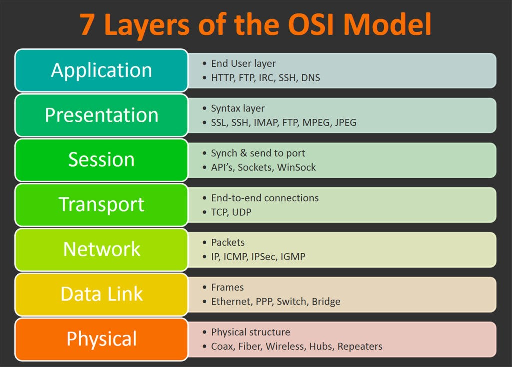
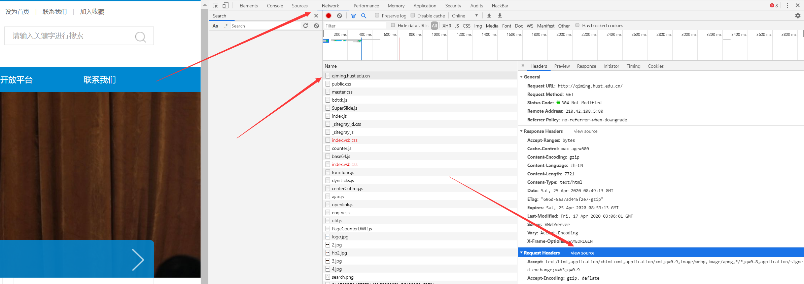

# Dian团队2020年春招能力测试题（公共题）

恭喜你通过了前面的考验，来到了能力测试题部分！

你将有7天的时间完成这一轮的任务，希望你能在这一周内多多尝试，突破自我，学习到更多新知识。

这道能力测试题分为递进的5个子任务：Connect、Get、Extract、Crawl和Analyze，建议按照先后次序完成，每个子任务单独评分，有的部分有附加的任务难度分（星级表示难度，难度越高分数越高）。

## 任务须知

1. 任务时间：2020年5月9日20:00~2020年5月16日23:59
2. 前置知识：你需要先掌握一些Git的相关知识
3. 任务方式：首先拥有1个Github或码云账号，然后fork本仓库，每天将进度push到自己的仓库（包括所有源代码、数据文件、学习笔记等）
4. 答疑方式：加入答疑QQ群
5. 任务要求：仅能使用C/C++，且不能使用除了cjson以外的第三方库，操作系统不限。最后需要提交源代码、数据文件、答辩演示文件（可以使用PowerPoint、Pages、TeX等）

## 任务背景

互联网起源于1969年美国的ARPANET，今年是Internet的第50年。

1994年，Internet上的Web站点超过了100M，此时互联网上的信息已经过于庞杂，普通用户难以找到自己想要的信息。与此同时，Yahoo诞生了，最初的雅虎选择「智能人工」来编辑目录的方式整理互联网上的各种信息。1998年，Stanford的Larry Page和Sergey Brin共同开发了Google最初的搜索引擎。

搜索引擎通常依赖于**网络爬虫**。网络爬虫是一种按照一定的规则，自动地抓取万维网信息的程序或者脚本。这道能力测试题也与网络爬虫密切相关。

## 1. Connect

### 子任务背景

你一定听说过网络的OSI模型吧？又称为七层模型，把网络通信的工作分为7层，自底向上分别是物理层、数据链路层、网络层、传输层、会话层、表示层和应用层。

由于网络框架十分成熟，我们很多时候只专注于顶层的应用层。这里我们将基于传输层的TCP协议使用**Socket**实现客户端和服务器之间的相互通信。

### 子任务要求

使用Socket在本地分别实现服务端和客户端程序，其中服务端监听本地的2020端口，客户端连接此服务端，随后客户端读取的任意输入都将发送给服务端，服务端收到后打印到终端，同时加上前缀`Server:`后发送给客户端，客户端接收到后直接打印到终端。

### 附加难度选项

+ [★★]服务端和客户端采用**非阻塞模式**会得到这个子任务额外的50%分数

## 2. Get

### 子任务背景

当我们在浏览器的地址栏输入1个网址（如`http://qiming.hust.edu.cn`）时，到浏览器上出现网页，这中间都发生了什么？这其中主要发生了DNS域名解析、建立TCP连接、发送HTTP包。

HTTP(HyperText Transfer Protocol，超文本传输协议)是Internet上使用最广泛的网络协议，主要用于从Web服务器传输超文本到本地浏览器。它基于TCP协议。

如何了解我们访问URL时候HTTP的包结构？我们可以通过浏览器的开发人员工具。打开Chrome或Firefox等浏览器，按F12打开开发人员工具，此时访问`http://qiming.hust.edu.cn`会看到右边的Network选项卡中最上面（即最早）的网络连接（一般名字为域名），点击即可看到HTTP请求（Request）和响应（Response）

点击请求或响应的`view source`即可看到原始的HTTP报文

> A：你听说过这个吗？http://dian.org.cn
>
> B：哦，我听说过http啊
>
> A：不是啊，我问的是http://dian.org.cn
>
> B：额，加了个冒号是啥意思？
>
> A：？？？

### 子任务要求

基于Socket实现对`http://qiming.hust.edu.cn`的访问，并将该html文件保存在本地

### 子任务提示

参考实现流程：

1. 将域名解析为IP
2. 与目标IP建立Socket连接
3. 向目标IP发送HTTP请求
4. 将收到的数据包保存

### 附加难度选项

+ [★★]实现任意http协议资源的下载器会得到这个子任务额外的30%分数

## 3. Extract

### 子任务背景

我们可以成功下载了一个html文件，但是......我们还想要方便直接地获取其中的信息，这需要你使用程序把这些有用的信息提取出来。

### 子任务要求

提取[中国大学MOOC](http://www.icourse163.org/)的一些慕课数据

[http://www.icourse163.org/university/view/all.htm#/](http://www.icourse163.org/university/view/all.htm#/)这个页面上有学校名单，点进去有各个学校的MOOC数据

要求提取1个学校（自选）的所有慕课的数据：开课学校、课程名称、开课时间、已参加人数、课程概述、授课目标、课程大纲、参考资料。保存到自定义格式的文件中（如txt、csv）

### 附加难度选项

+ [★★]保存为json或csv文件会得到这个子任务额外的30%分数
+ [★★★]使用自己实现的正则表达式匹配器会得到这个子任务额外的50%分数
+ [★★★★★]使用自己实现的HTML解析器会得到这个子任务额外的100%分数

## 4. Crawl

### 子任务背景

很好！我们已经实现了许多基本的功能，现在让我们来实现一个真正的爬虫！

 一般的网络爬虫的基本工作流程如下：

1. 首先选取一部分种子URL作为根

2. 将这些URL放入待抓取URL队列
3. 从待抓取URL队列中取出队首的URL，并将URL对应的网页下载下来，将想要提取的数据提取出来保存
4. 分析当前网页内容中出现的其他URL，若没有被抓取过且需要被抓取，则加入待抓取URL队列
5. 若队列不为空，跳转第2步，否则结束抓取

### 子任务要求

使用自己设计的数据结构（不能使用C++ STL的容器）和前面的子任务已经实现的模块**按照上述流程**来实现一个爬虫，爬取上述[中国大学MOOC](http://www.icourse163.org/)的慕课数据（开课学校、课程名称、开课时间、已参加人数、课程概述、授课目标、课程大纲、参考资料）

### 附加难度选项

+ [★★★]实现进度保存和进度读取功能，使得不用每次运行程序都从头开始读，会获得这个子任务额外的30%分数
+ [★★★]实现多线程并发抓取会获得这个子任务额外的50%分数**（请注意不要使用过多的线程，这个附加选项仅考察多线程编程本身，线程数可设为2）**
+ [★★★★★]实现https网页的抓取会获得这个子任务额外的100%分数

## 5. Analyze

### 子任务背景

如何让数据发挥应有的价值？我们现在已经有了大量数据，现在需要读取这些数据来进行一些简单的数据分析。

### 子任务要求

使用自己的爬虫爬取到的数据，进行数据分析，得出一些研究结论，既可以自己设计工具研究，也可以使用MATLAB、Excel等工具

### 附加难度选项

+ [★★★]读取json或csv文件会得到这个子任务额外的40%分数（可以使用提供的cjson库，位于本仓库cjson目录下）
+ [★★★★★]实现二维数据点的绘图功能会得到这个子任务额外的100%分数
